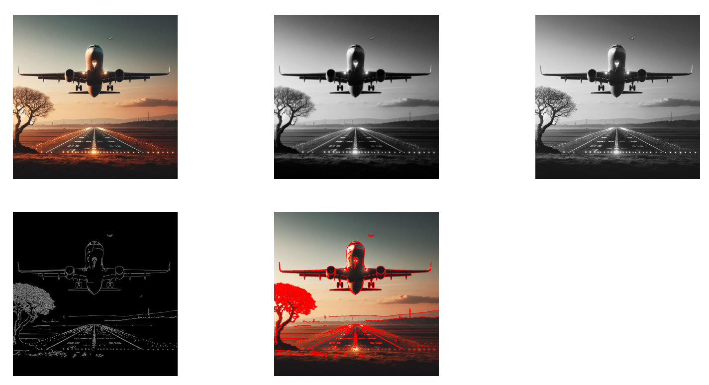

- imagem 1: Imagem original
- imagem 2: tranformação para escala de cinza
- imagem 3: limiarização invertida, separando o que é claro do que é escuro e invertendo os valores, passo necessário para destacar objetos de fundo
- imagem 4: aplicação do canny para detecção de bordas.
- imagem 5: bordas desenhadas pelo canny aplicadas na imagem original do avião.
