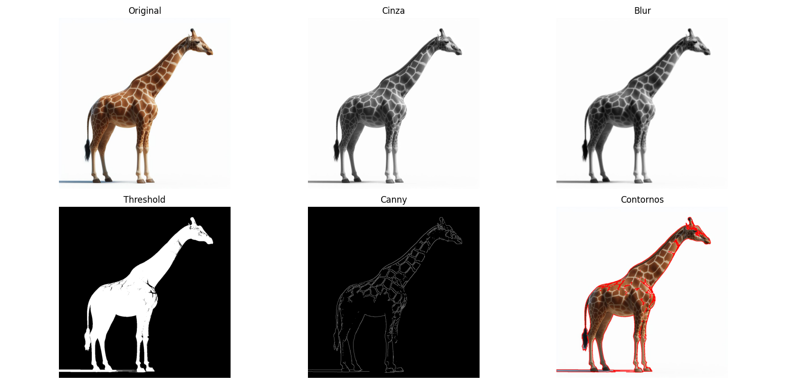

## Explicação das imagens  

1. Original: É a imagem carregada e convertida para o espaço de cores RGB  
2. Cinza:  Conversão da imagem RGB para uma imagem em tons de cinza para reduzir compelxidade computacional e destacar intensidade luminosa  
3. Blur: Aplicação de um filtro de média (blur) à imagem em escala de cinza para suavizar imagem e reduzir ruídos.  
4. Threshold: Conversão da imagem em preto e branco (binária), com base em um valor limite para isolar objetos.  
5. Canny: Detectar bordas na imagem borrada para identificar contornos.  
6. Contornos: Delimitação das formas detectadas a partir da imagem binária, desenhando os contornos sobre a imagem original.